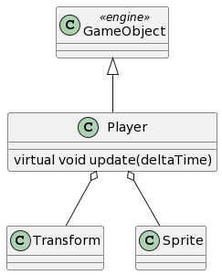
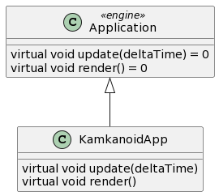

# Peli 1 - kamkanoid: Tekninen suunnitelma

## Asiakasvaatimukset

Yksinkertainen peli ilman grid mappia. Tämä sisältää myös esimerkin Main menusta ja High score taulukosta. Refenssipelinä Arkanoid (2 leveliä).

## Sovelluksen Arkkitehtuuri

## Player
TODO: Lisää kuvausteksti kustakin GameObject tyypistä tähän oman aliotsikon alle. Kerro, miten peliobjekti toimii ja mitä se tekee.

## Enemy
TODO: Lisää kuvausteksti kustakin GameObject tyypistä tähän oman aliotsikon alle. Kerro, miten peliobjekti toimii ja mitä se tekee.

## GameApplication -luokka
TODO: Lisää kuvausteksti peliapplikaatio luokan toiminnasta ja selitys siitä miten pelilogiikka toimii.

## Muut sovelluksen luokat
TODO: Mikäli pelin tekemisessä on muita käytettyjä apuluokkia, lisää niiden kuvaukset tänne kukin oman aliotsikkonsa alle
