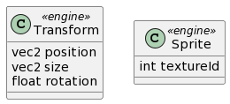

# Tekninen suunnitelma

# Esimerkkipelien tekniset suunnitelmat omissa dokumenteissaan
- [Peli 1: kamkanoid tekninen suunnitelma](doc/kamkanoid_tdd.md)
- [Peli 2: kamkman tekninen suunnitelma](doc/kamkman_tdd.md)
- [Peli 3: kamkikong tekninen suunnitelma](doc/kamkikong_tdd.md)

# Moottorin arkkitehtuuri

## Luokka 1
TODO: Lisää kuvaus kustakin luokasta oman alitosikkonsa alle:
- TODO: Kerro, mikä on luokan rooli arkkitehtuurissa ja mitä luokalla voi tehdä ja miten.

## Luokka 2
- TODO: Kerro, mikä on luokan rooli arkkitehtuurissa ja mitä luokalla voi tehdä ja miten.

# Moottorin tarjoamat komponentit

## Transform
- TODO: Kerro lyhyesti, miten komponentta käytetään aj mitä attribuutteja sillä on.

## Sprite
- TODO: Kerro lyhyesti, miten komponentta käytetään aj mitä attribuutteja sillä on.

